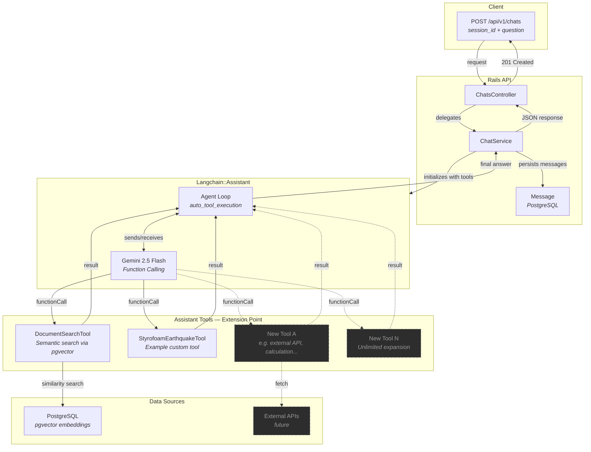
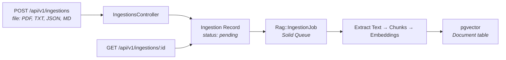

# RAG API — Retrieval-Augmented Generation with Rails + Tool Use

[](https://github.com/luisgsilva950/example-rails-rag-api/actions/workflows/ci.yml)
[](https://codecov.io/gh/luisgsilva950/example-rails-rag-api)

A Ruby on Rails API that implements **RAG (Retrieval-Augmented Generation)** with **Tool Use (Function Calling)** using Google Gemini and PostgreSQL with **pgvector**. The LLM autonomously decides when to search documents or invoke other tools via `Langchain::Assistant`.

## Stack

| Component       | Technology                                         |
| --------------- | -------------------------------------------------- |
| Framework       | Ruby on Rails 8.1 (API mode)                       |
| Database        | PostgreSQL 16 with pgvector                        |
| Embeddings      | `gemini-embedding-001` (3072 dimensions)           |
| LLM             | Google Gemini (`gemini-2.5-flash`)                 |
| Tool Use        | Gemini Function Calling via `Langchain::Assistant` |
| Orchestration   | `langchainrb` 0.19+                                |
| Background Jobs | Solid Queue                                        |
| Testing         | RSpec, FactoryBot, Faker, WebMock                  |

---

## Architecture

### Chat Flow — Tool Use with Function Calling



The chat endpoint uses **Gemini Function Calling** via `Langchain::Assistant`. Instead of always retrieving documents, the LLM autonomously decides **when** to call tools based on the question. The agent loop handles the full cycle: send question → LLM requests a function call → execute tool → return result → LLM generates final answer.

### Ingestion Flow



---

## Prerequisites

- **Ruby** 3.3+
- **Docker** and **Docker Compose**
- A **Google Gemini API Key** ([Get one here](https://aistudio.google.com/apikey))

---

## Getting Started

### 1. Clone the repository

```bash
git clone <repository-url>
cd example-rails-rag-api
```

### 2. Configure environment variables

Copy the example and set your Gemini API key:

```bash
cp .env.example .env
```

Edit `.env`:

```dotenv
# PostgreSQL
POSTGRES_USER=rag_user
POSTGRES_PASSWORD=rag_password
POSTGRES_HOST=localhost
POSTGRES_PORT=5433

# Google Gemini
GEMINI_API_KEY=your_gemini_api_key_here
GEMINI_EMBEDDING_MODEL=gemini-embedding-001
```

### 3. Start infrastructure (PostgreSQL with pgvector)

```bash
docker compose up -d
```

This starts **PostgreSQL 16 with pgvector** on port `5433` (configurable via `POSTGRES_PORT`).

### 4. Install dependencies

```bash
bundle install
```

### 5. Create and migrate the database

```bash
rails db:create db:migrate
```

### 6. Start the server with Solid Queue

**One command to rule them all** — starts Docker, waits for services, prepares the DB, and launches Rails with Solid Queue:

```bash
bin/start
```

Or start the Rails server with Solid Queue manually:

```bash
bin/dev
```

Both commands run Solid Queue as a Puma plugin (via `SOLID_QUEUE_IN_PUMA=1`), so background jobs are processed in the same process as the web server — no separate worker needed.

If you only need the Rails server without background job processing:

```bash
rails server
```

> **Note:** Document ingestion (`POST /api/v1/ingestions`) requires Solid Queue to be running, since the ingestion pipeline runs as a background job.

The API will be available at `http://localhost:3000`.

---

## API Endpoints

### Health Check

```
GET /up
```

Returns `200 OK` if the application is running.

---

### Upload a Document (Async Ingestion)

```
POST /api/v1/ingestions
```

Uploads a file (PDF, TXT, JSON, or Markdown), saves it, and enqueues a background job to extract text, split into chunks, generate embeddings, and store them in PostgreSQL with pgvector.

**Supported formats:** `.pdf`, `.txt`, `.json`, `.md`

#### Request

```bash
curl -X POST http://localhost:3000/api/v1/ingestions \
  -F "file=@/path/to/your/document.pdf"
```

#### Response (202 Accepted)

```json
{
  "message": "Document queued for ingestion",
  "ingestion_id": 1,
  "status": "pending",
  "filename": "document.pdf"
}
```

#### Errors

| Status | Cause                                   |
| ------ | --------------------------------------- |
| 400    | Missing file or unsupported file format |
| 500    | Unexpected server error                 |

---

### Check Ingestion Status

```
GET /api/v1/ingestions/:id
```

Returns the current status of an ingestion job. Use this to poll for completion after uploading a document.

#### Request

```bash
curl http://localhost:3000/api/v1/ingestions/1
```

#### Response (200 OK)

```json
{
  "id": 1,
  "status": "completed",
  "filename": "document.pdf",
  "chunks_count": 42,
  "error_message": null
}
```

#### Ingestion Statuses

| Status       | Description                                         |
| ------------ | --------------------------------------------------- |
| `pending`    | Queued, waiting for background processing           |
| `processing` | Currently extracting text and generating embeddings |
| `completed`  | Successfully ingested into pgvector                 |
| `failed`     | An error occurred (see `error_message`)             |

---

### Send a Chat Message (RAG with Tool Use)

```
POST /api/v1/chats
```

Sends a question to the RAG pipeline with **Tool Use**. The `Langchain::Assistant` manages an agent loop where Gemini decides which tools to invoke (e.g., `DocumentSearchTool` for pgvector similarity search) before generating the final answer. Conversation history is maintained per session.

#### Request

```bash
curl -X POST http://localhost:3000/api/v1/chats \
  -H "Content-Type: application/json" \
  -d '{
    "session_id": "my-session-123",
    "question": "What are the main topics covered in the document?"
  }'
```

#### Response (201 Created)

```json
{
  "session_id": "my-session-123",
  "answer": "Based on the document, the main topics covered are..."
}
```

#### Parameters

| Parameter    | Type   | Required | Description                                        |
| ------------ | ------ | -------- | -------------------------------------------------- |
| `session_id` | string | Yes      | Unique session ID to maintain conversation history |
| `question`   | string | Yes      | The user's question                                |

#### Errors

| Status | Cause                              |
| ------ | ---------------------------------- |
| 400    | Missing `session_id` or `question` |
| 500    | LLM or vector search failure       |

---

## Usage Example — Full Workflow

```bash
# Step 1: Upload a document (returns immediately)
curl -X POST http://localhost:3000/api/v1/ingestions \
  -F "file=@./my-report.pdf"
# → {"ingestion_id": 1, "status": "pending", ...}

# Step 2: Poll until ingestion is complete
curl http://localhost:3000/api/v1/ingestions/1
# → {"status": "completed", "chunks_count": 42, ...}

# Step 3: Ask questions about it (Gemini will use DocumentSearchTool automatically)
curl -X POST http://localhost:3000/api/v1/chats \
  -H "Content-Type: application/json" \
  -d '{"session_id": "session-001", "question": "Summarize the key findings"}'

# Step 4: Follow up (same session maintains conversation history)
curl -X POST http://localhost:3000/api/v1/chats \
  -H "Content-Type: application/json" \
  -d '{"session_id": "session-001", "question": "Can you elaborate on item 3?"}'

# Step 5: Start a new conversation (different session_id)
curl -X POST http://localhost:3000/api/v1/chats \
  -H "Content-Type: application/json" \
  -d '{"session_id": "session-002", "question": "What does the document say about costs?"}'
```

---

## Creating Custom Tools

The architecture supports adding new tools that the LLM can invoke via function calling. Each tool is a Ruby class that uses the `Langchain::ToolDefinition` DSL.

### 1. Create the tool class

```ruby
# app/tools/rag/my_custom_tool.rb
module Rag
  class MyCustomTool
    extend Langchain::ToolDefinition

    define_function :execute, description: "Description of what this tool does" do
      property :input, type: "string", description: "What the input represents", required: true
    end

    def execute(input:)
      # Your tool logic here — call an API, query a database, compute something
      "Result for: #{input}"
    end
  end
end
```

### 2. Register it in ChatService

```ruby
# app/services/rag/chat_service.rb
def self.default_tools
  [ DocumentSearchTool.new, MyCustomTool.new ]
end
```

### 3. That's it

Gemini will automatically discover the tool via its function schema and decide when to call it based on the user's question. No routing or conditional logic needed — the LLM handles tool selection autonomously.

**Included tools:**

| Tool                      | Purpose                                            |
| ------------------------- | -------------------------------------------------- |
| `DocumentSearchTool`      | Semantic search over ingested documents (pgvector) |
| `StyrofoamEarthquakeTool` | Example custom tool with a fixed response          |

---

## Running Tests

```bash
# Run full test suite
bundle exec rspec

# Run with documentation format
bundle exec rspec --format documentation

# Run specific spec files
bundle exec rspec spec/models/
bundle exec rspec spec/services/
bundle exec rspec spec/requests/
bundle exec rspec spec/jobs/
bundle exec rspec spec/tools/
```

### Test Coverage

| Layer     | Spec File                                          | Tests  |
| --------- | -------------------------------------------------- | ------ |
| Job       | `spec/jobs/rag/ingestion_job_spec.rb`              | 5      |
| Model     | `spec/models/document_spec.rb`                     | 5      |
| Model     | `spec/models/ingestion_spec.rb`                    | 17     |
| Model     | `spec/models/message_spec.rb`                      | 9      |
| Request   | `spec/requests/api/v1/ingestions_spec.rb`          | 12     |
| Request   | `spec/requests/api/v1/chats_spec.rb`               | 6      |
| Service   | `spec/services/rag/chat_service_spec.rb`           | 6      |
| Service   | `spec/services/rag/ingestion_service_spec.rb`      | 10     |
| Tool      | `spec/tools/rag/document_search_tool_spec.rb`      | 4      |
| Tool      | `spec/tools/rag/styrofoam_earthquake_tool_spec.rb` | 3      |
| **Total** |                                                    | **77** |

---

## Project Structure

```
app/
├── controllers/
│   └── api/v1/
│       ├── base_controller.rb       # Centralized error handling
│       ├── chats_controller.rb      # POST /api/v1/chats
│       └── ingestions_controller.rb  # POST /api/v1/ingestions + GET :id
├── jobs/
│   └── rag/
│       └── ingestion_job.rb         # Background ingestion via Solid Queue
├── models/
│   ├── document.rb                  # Chunks + pgvector embeddings
│   ├── ingestion.rb                 # Ingestion status tracking
│   └── message.rb                   # Chat history (session_id, role, content)
├── services/
│   └── rag/
│       ├── chat_service.rb          # Langchain::Assistant + Tool Use orchestrator
│       └── ingestion_service.rb     # File → chunks → embeddings → pgvector
└── tools/
    └── rag/
        ├── document_search_tool.rb      # pgvector similarity search tool
        └── styrofoam_earthquake_tool.rb # Example custom tool

config/
├── initializers/
│   └── langchain.rb                 # Global GEMINI_LLM configuration

spec/
├── factories/
│   ├── documents.rb
│   ├── ingestions.rb
│   └── messages.rb
├── jobs/rag/
│   └── ingestion_job_spec.rb
├── models/
│   ├── document_spec.rb
│   ├── ingestion_spec.rb
│   └── message_spec.rb
├── requests/api/v1/
│   ├── chats_spec.rb
│   └── ingestions_spec.rb
├── services/rag/
│   ├── chat_service_spec.rb
│   └── ingestion_service_spec.rb
└── tools/rag/
    ├── document_search_tool_spec.rb
    └── styrofoam_earthquake_tool_spec.rb
```

---

## Key Configuration Files

| File                               | Purpose                                      |
| ---------------------------------- | -------------------------------------------- |
| `docker-compose.yml`               | PostgreSQL 16 with pgvector container        |
| `.env`                             | Environment variables (API keys, DB config)  |
| `config/database.yml`              | PostgreSQL connection settings               |
| `config/initializers/langchain.rb` | Gemini LLM + embedding model initialization  |
| `config/queue.yml`                 | Solid Queue configuration                    |
| `app/tools/rag/`                   | Tool definitions for Gemini Function Calling |

---

## License

This project is available as open source under the terms of the [MIT License](https://opensource.org/licenses/MIT).
